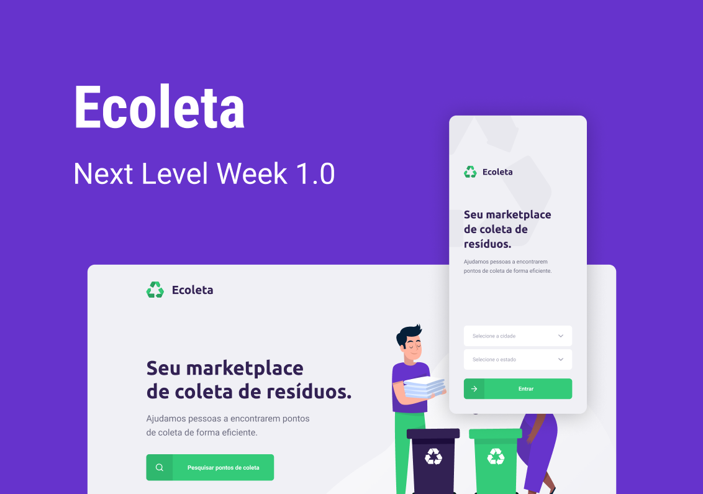

<h1 align="center">
    
</h1>

<p align="center">
  <a href="#computer-projeto">Projeto</a>&nbsp;&nbsp;&nbsp;|&nbsp;&nbsp;&nbsp;
  <a href="#rocket-tecnologias">Tecnologias</a>&nbsp;&nbsp;&nbsp;|&nbsp;&nbsp;&nbsp;
  <a href="#art-layout">Layout</a>&nbsp;&nbsp;&nbsp;|&nbsp;&nbsp;&nbsp;
  <a href="#thinking-como-contribuir">Como contribuir</a>&nbsp;&nbsp;&nbsp;|&nbsp;&nbsp;&nbsp;
  <a href="#gear-como-configurar-e-executar">Como configurar e executar</a>&nbsp;&nbsp;&nbsp;|&nbsp;&nbsp;&nbsp;
  <a href="#memo-licença">Licença</a>
</p>

<br/>

<p align="center">
  
  
  
  
  
  
  <a href="https://github.com/Diziano/ecoleta/commits/master">
    
  </a>
  
  <a href="https://github.com/Diziano/ecoleta/issues">
    
  </a>
  
  
  
</p>

<br/>



<br />


## :computer: Projeto
O Ecoleta é um marketplace de coleta de resíduos, cujo principal objetivo é contribuir com o meio ambiente. O projeto serve de ponte entre empresas ou entidades que coletam residuos organicos e inorganicos a pessoas que precisam descartar esses resíduos, como lâmpadas, pilhas e baterias, papéis e papelão, resídos eletrônicos, resíduos orgânicos e óleo de cozinha. O aplicativo exibe um mapa com os pontos de coletas, onde o usuário pode buscar os pontos mais próximos de sua residência. Esse é também um projeto de fins didáticos, desenvolvido durante a Next Level Week da [Rocketseat](https://rocketseat.com.br/).

<br/>

## :rocket: Tecnologias
Esse projeto foi desenvolvido com as seguintes tecnologias:

#### Back-end
- [Node.js](https://nodejs.org/en)
- [TypeScript](https://github.com/microsoft/TypeScript)
- [Express](https://github.com/expressjs/express)
- [sqlite](https://github.com/sqlite/sqlite)
- [knex.js](https://github.com/knex/knex)

#### Web
- [ReactJS](https://github.com/facebook/react)
- [TypeScript](https://github.com/microsoft/TypeScript)
- [axios](https://github.com/axios/axios)
- [ESLint](https://github.com/eslint/eslint)

#### Mobile
- [React Native](https://github.com/facebook/react-native)
- [TypeScript](https://github.com/microsoft/TypeScript)
- [expo](https://github.com/expo/expo)
- [axios](https://github.com/axios/axios)

<br/>

## :art: Layout

Você pode visualizar o layout do projeto no formato através [desse link](https://www.figma.com/file/1SxgOMojOB2zYT0Mdk28lB/Ecoleta). Lembrando que você irá precisar ter uma conta no [Figma](http://figma.com/).

<br />

## :thinking: Como contribuir

- Faça um fork desse repositório;
- Cria uma branch com a sua feature: `git checkout -b minha-feature`;
- Faça commit das suas alterações: `git commit -m 'feat: Minha nova feature'`;
- Faça push para a sua branch: `git push origin minha-feature`.

Depois que o merge da sua pull request for feito, você pode deletar a sua branch.

<br/>

## :gear: Como configurar e executar

```bash

    # Clonar o repositório
    $ git clone https://github.com/diziano/ecoleta.git

    # Navegar para o diretório
    $ cd ecoleta

```
#### Back-end

- No arquivo [knexfile.ts](backend/knexfile.ts) configure os parâmetros de acesso ao banco de dados;

- Para alterações do banco de dados aconselha-se utilizar a CLI do knex: <code>npx knex {seu comando}</code>. Confira a documentação [aqui](http://knexjs.org/).

```bash

    # Navegar para o diretório
    $ cd backend
    
    # Instalar as dependências
    $ npm
    
    # Executar migrations para criação das tabelas na base de dados
    $ npm run knex:migrate

    # Executar seeds para inserção de dados iniciais na base de dados
    $ npm run knex:seed

    # Iniciar o projeto
    $ npm start
    
    # Iniciar o projeto em desenvolvimento
    $ npm run dev
```

#### Web

```bash

    # Navegar para o diretório
    $ cd web
    
    # Instalar as dependências
    $ npm

    # Iniciar o projeto
    $ npm start
    
    # Executar build
    $ npm build
```

#### Mobile

```bash

    # Navegar para o diretório
    $ cd mobile

    # Iniciar o projeto
    $ npm start
    
```

<br/>

## :memo: Licença
Esse projeto está sob a licença MIT. Veja o arquivo [LICENSE](LICENSE.md) para mais detalhes.

---

Made with :black_heart: by Vynny21 (Vinicius Prudencio)
